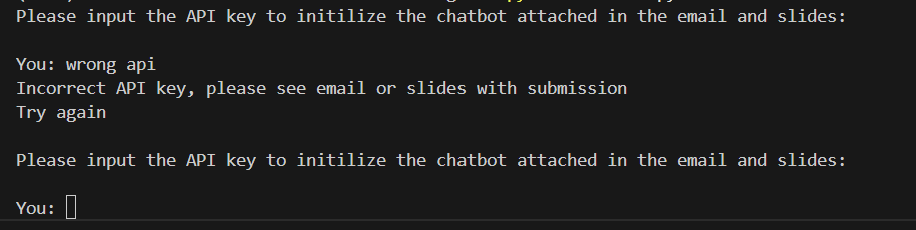
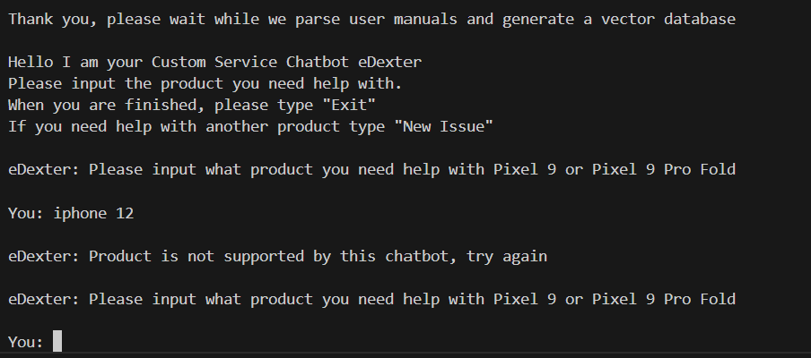
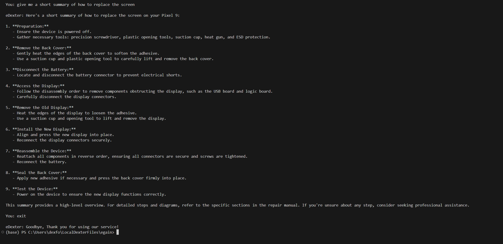
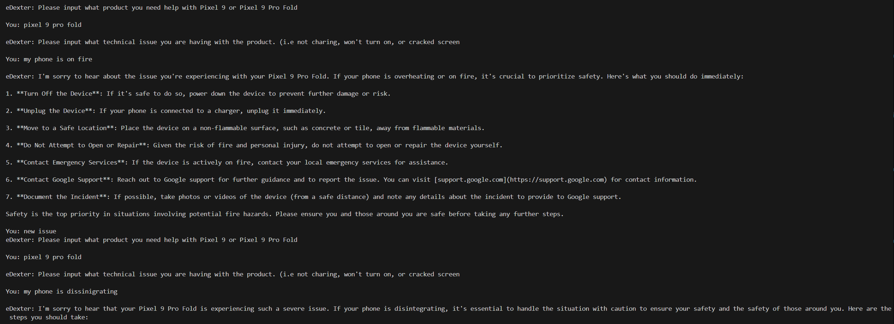

# eDexter Chatbot - A technical issue solver for Google Pixel 9 and Google Pixel 9 Pro Fold

## Setup Instructions

1. Install relevant python packages
    - pip install openai faiss-cpu numpy PyPDF2
2. Locate openAI API key provided in slides or email
    - I did not want to include this on my Github of course
3. Run the chatbot using the following command
    - python chatbot.py

## Explanation of Approach 

During this project I made sure to take a modular approach with all my code. All core functions are seperated into different methods for easier iteration, testing and debugging. The code can be thought of in 4 sections: Parsing technical users manuals, placing these manuals into a vectorized database, prompting the user for the context of there problem, and code to prompt the chatbot. I created a chatbot to help solve issue with the pixel product line because the repair manuals were easily avaiable online as pdfs. At first I wanted the code to work for more products but finding instructions to fix iphones and Samsung galaxy phones was difficult. Given that the bot is supposed to solve a technical issue, i felt instruction manuals would be the best source of data to improve gpt4s initial capabilities. I chose gpt4 because with the advent of LLM, an if else tree seemed far too elementary. With gpt the user can ask more detailed questions with natural language and further prompt the chatbot for specific if they are lost.

I wanted to finetune the model but I realized I did not have the time or resources to do so. After explroing this path, I tried passing full instruction manuals to the chabot, but they ended being too long. This led me to learn about vectorized databases. With this approach, only relevant entries from the instruction manuals are retrieved and given to the chatbot. The vectorizaton of these pdfs is done at runtime which significanly slows down the initialization of the chabot, but for the increased accuracy and skills I learned implimenting it, I believe it was worth it. 

## Screenshots

Unexpected error 1: Incorrect API Key

Unexpected error 2: Wrong phone model

Code in action: Chatbot helps replace screen

Code in action: Chabot helps with an average issue
